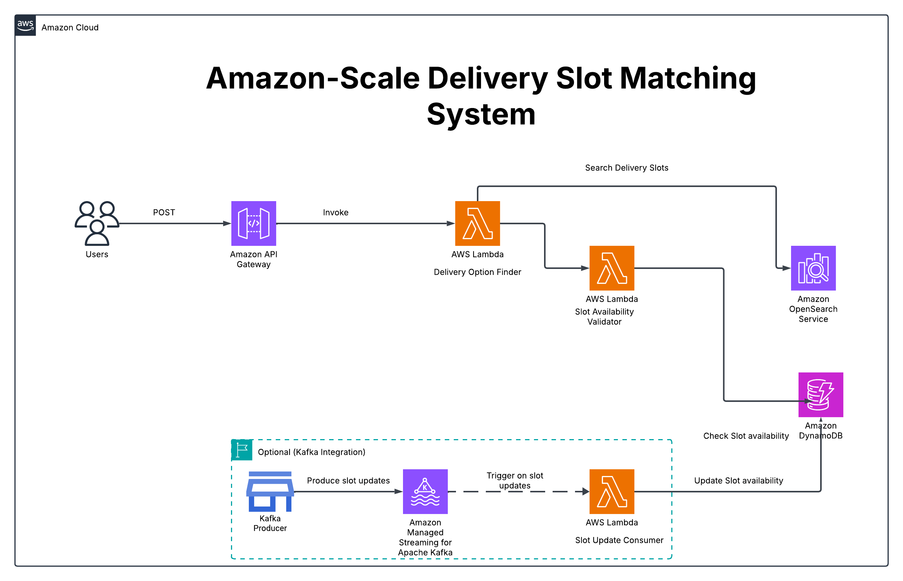

# 🚚 Amazon-Scale Delivery Slot Matching System

A real-time delivery slot validation system inspired by Amazon’s scale. It uses a two-stage search architecture to improve booking success and user experience.



## 🔍 Use Case
Customers searching for available delivery slots often face delays due to real-time validations. This project solves that with a two-step architecture:
1. **Stage 1**: Fetch product candidates from OpenSearch
2. **Stage 2**: Validate delivery slot availability via DynamoDB

## ✅ Tech Stack
- AWS Lambda (Python)
- AWS API Gateway
- DynamoDB
- OpenSearch
- Streamlit UI
- Optional: Kafka (planned for ingestion pipeline)

## 🧪 Example Usage

**Request:**
```json
{
  "product_ids": ["P123", "P234"],
  "slot": "2025-07-25T10:00-12:00"
}
```

**Response:**
```json
[
  {
    "product_id": "P123",
    "delivery_slot": "2025-07-25T10:00-12:00",
    "status": "available"
  },
  {
    "product_id": "P234",
    "delivery_slot": "2025-07-25T10:00-12:00",
    "status": "not available"
  }
]
```

## 🚀 Future Enhancements
- Real-time ingestion using Kafka → Lambda → DynamoDB
- Add Cognito-based authentication
- Build dashboard for admin slot usage analytics

