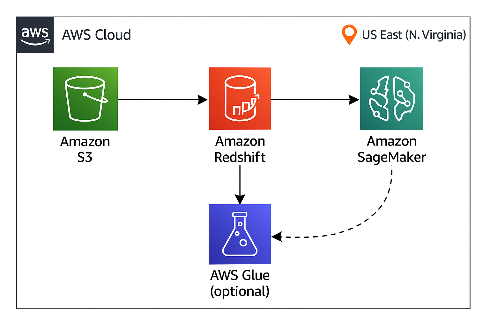

# Fraudulent Return Detection using Amazon SageMaker & Redshift Serverless



## Overview

This project identifies fraudulent product return patterns in an e-commerce environment. Leveraging a synthetic dataset of customer returns, the solution applies machine learning (Random Forest with SMOTE) on AWS SageMaker to flag potentially fraudulent behavior. The system is designed for seamless integration with AWS Redshift Serverless and can scale for real-world deployment.

---

## Problem Statement

**Returns Fraud** is a growing problem in e-commerce, costing businesses millions annually. Common fraud scenarios include:
- Repeated returns without a valid reason
- Claiming damaged items that were not damaged
- Manipulative return frequency patterns

The goal is to **build a predictive model** that can classify a return as **fraudulent or not** using behavioral and transactional features.

---

## Dataset Description

The dataset `synthetic_returns.csv` (loaded via Amazon S3) contains the following columns:

| Feature                 | Description                                  |
|-------------------------|----------------------------------------------|
| `customer_id`           | Unique customer identifier                   |
| `product_id`            | Product identifier                           |
| `order_value`           | Monetary value of the order                  |
| `return_reason`         | Textual reason for the return                |
| `return_count`          | Total return count for the customer          |
| `damaged_flag`          | 1 if item was marked damaged, else 0         |
| `days_since_last_return`| Time gap from last return                    |
| `is_fraud`              | Target variable (1 = Fraudulent, 0 = Not)    |

---

## Solution Architecture

- **Data Source**: Synthetic CSV uploaded to **Amazon S3**
- **Data Loading**: Using **pandas** directly from S3
- **Preprocessing**: One-hot encoding + SMOTE for class balance
- **Model**: RandomForestClassifier
- **Evaluation**: Confusion Matrix and Classification Report
- **Deployment**: Run entirely on **Amazon SageMaker Studio**
- **(Optional)**: Connects to **Amazon Redshift Serverless** for scalable querying and model deployment

---

##  Model Performance

- Achieved **~100% accuracy** (due to synthetic nature of dataset)
- Confusion Matrix:

```
[[1978    0]
 [   0   22]]
```

- Classification Report:
```plaintext
              precision    recall  f1-score   support
           0       1.00      1.00      1.00      1978
           1       1.00      1.00      1.00        22
    accuracy                           1.00      2000
```

---

## Requirements

```bash
pip install pandas scikit-learn imbalanced-learn matplotlib seaborn redshift-connector
```

---

##  How to Run (on SageMaker)

```python
import pandas as pd

# Load from S3
s3_path = 's3://fraud-return-data/synthetic_returns.csv'
df = pd.read_csv(s3_path)
```

### Connect to Amazon Redshift Serverless

```python
import redshift_connector

conn = redshift_connector.connect(
    is_serverless=True,
    serverless_acct_id='YOUR_ACCOUNT_ID',
    serverless_work_group='YOUR_WORKGROUP_NAME',
    database='dev',
    user='admin',
    password='your_password',
    region='us-east-1'
)

df = pd.read_sql("SELECT * FROM fraudulent_returns", conn)
```

---

##  Next Steps

- Replace synthetic data with real transactional logs
- Add streaming pipeline via **Amazon Kinesis**
- Trigger real-time detection using **Lambda + SageMaker Endpoint**
- Visualize alerts on **Amazon QuickSight**