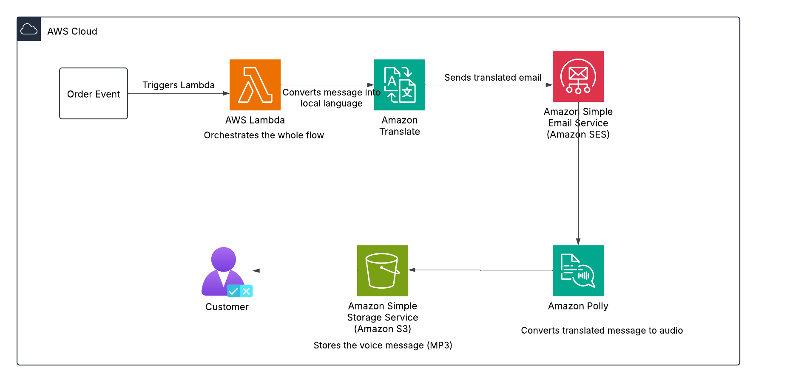

# Multi-language Order Notifications (AWS Serverless)

Deliver multilingual shipping notifications via email and voice using **AWS Lambda**, **Amazon Translate**, **Amazon Polly**, **Amazon SES**, and **Amazon S3** — all running serverlessly and free-tier friendly.

---

## Features

- 🌍 Sends shipping updates in the **customer's preferred language**
- 📧 Delivers **translated emails** via Amazon SES
- 🔊 Generates **voice messages** using Amazon Polly
- 🪣 Stores audio files as **MP3s in Amazon S3**
- 💡 Built with lightweight AWS Lambda orchestration (Python)

---

## Use Case

> Reduce international “Where is my order?” tickets by communicating order status via **localized email and audio**.

---

##  Architecture



---

## AWS Services Used

| Service          | Purpose                              |
|------------------|---------------------------------------|
| AWS Lambda       | Orchestration logic                  |
| Amazon Translate | Translate English → target language   |
| Amazon SES       | Send translated email to customer     |
| Amazon Polly     | Generate voice (MP3) of the message   |
| Amazon S3        | Store voice files                     |

---

##  Project Files

| File Name             | Purpose                          |
|------------------------|----------------------------------|
| `lambda_function.py`  | Main Lambda logic (Python 3.10)  |
| `test_events.json`    | Sample test events (bulk mode)   |
| `run_bulk_tests.py`   | Local script to invoke tests     |

---

## Sample Test Event

{
  "customer_name": "Juan",
  "email": "juan@example.com",
  "language_code": "es",
  "order_id": "AMZ123456",
  "delivery_date": "2025-07-25"
}
```

---

## Test Results

Example email body:

```
Hola Juan,
Tu pedido AMZ123456 ya se ha enviado y llegará el 25 de julio de 2025.
Gracias por comprar en Amazon.
```

Optional MP3 stored in:  
`s3://your-bucket/AMZ123456_voice.mp3`

---

## 🧹 Cleanup Guide

To avoid charges:
- ❌ Delete Lambda function
- ❌ Remove verified SES email (optional)
- ❌ Delete IAM role
- ❌ Delete S3 bucket (if used)
- ❌ Remove local files

---
