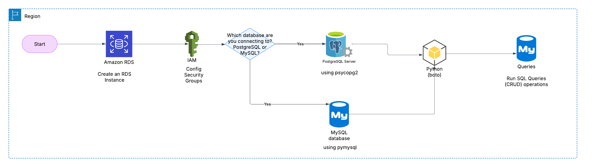
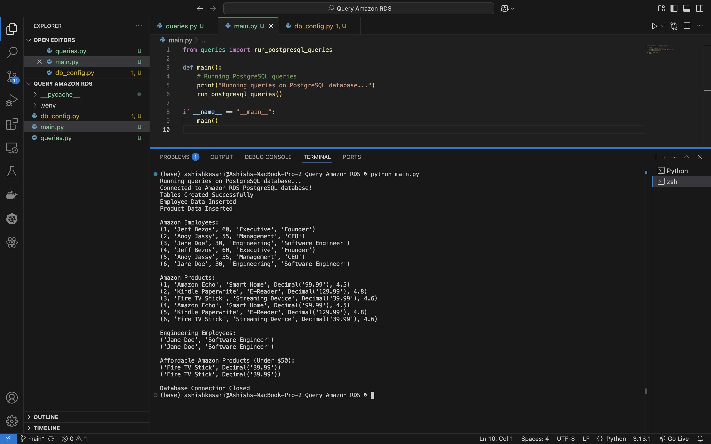

# **Query Amazon RDS with Python (PostgreSQL)**

# **Overview**

This project demonstrates how to:
1. Deploy an Amazon RDS instance (PostgreSQL/MySQL).
2. Connect to it using Python (psycopg2 for PostgreSQL, pymysql for MySQL).
3. Perform CRUD (Create, Read, Update, Delete) operations on the RDS instance.
4. Secure the database using VPC, Security Groups, and IAM roles.

## **Architecture**

The architecture consists of the following components:

- Python Client: A Python script that connects to the Amazon RDS instance and performs database operations.
- Amazon RDS (PostgreSQL/MySQL): A managed relational database service on AWS, where the data is stored and queried.
- VPC (Virtual Private Cloud): Provides a secure network environment for the Python client to connect to Amazon RDS, ensuring controlled access.
- Security Groups: Defines firewall rules that control inbound and outbound traffic to the Amazon RDS instance.
- IAM Role: Manages permissions to securely access AWS services and allows controlled interaction with Amazon RDS.

## **Prerequisites**

Before getting started, ensure that you have the following:

. An AWS account with permissions to create and manage RDS instances.
. Python 3.x installed on your machine.
. Libraries: psycopg2 for PostgreSQL or pymysql for MySQL. To install the required libraries, run the following:
. pip install psycopg2 pymysql
. Setup AWS RDS

* Create an Amazon RDS PostgreSQL or MySQL instance:
* Go to the AWS Console → RDS → Create Database.
* Select PostgreSQL or MySQL as the engine based on your choice.
* Configure the RDS instance settings (e.g., instance class, storage, VPC, security groups, etc.).
* Enable Public Access if you want to connect from outside AWS (be cautious for production).
* Retrieve the Endpoint, Database Name, Username, and Password for later use in the Python script.
* Create Security Groups:
* Create a security group with inbound rules allowing access on port 5432 (PostgreSQL) or 3306 (MySQL) from the appropriate IPs.
* Create IAM Role:
* Optionally, you can create an IAM role with policies to control access to the RDS instance.

## **Python Environment Setup:**
- Install Python dependencies using pip:
- pip install psycopg2 pymysql
- Ensure your AWS RDS connection details (e.g., endpoint, username, password) are updated in the Python script.

## **Code Explanation**
- The Python script will perform the following actions:
- Connect to RDS: Establish a connection to your Amazon RDS PostgreSQL or MySQL database.
- Create Tables: Create necessary tables for storing data.
- Insert Data: Add sample data into the database.
- Query Data: Execute SQL queries to fetch and manipulate data.

If everything went well you may see the following output:

