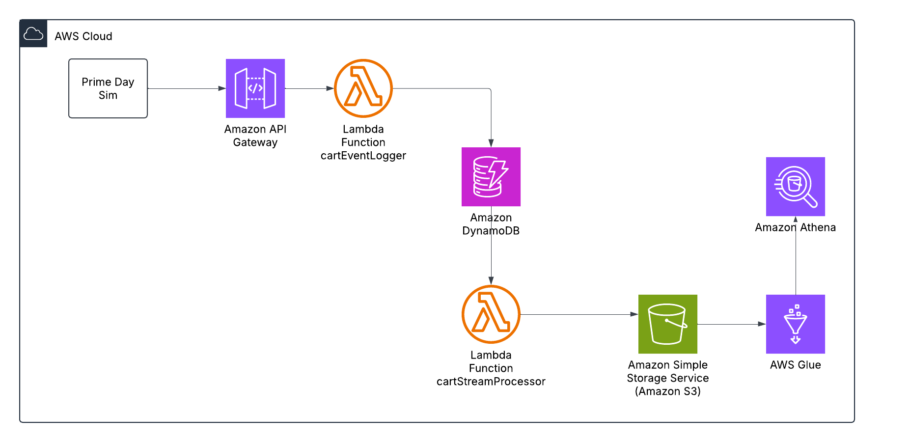

# Real-Time Cart Abandonment Tracker (Amazon Prime Day Simulation) 🛒

> Built to simulate real-time cart abandonment scenarios during Amazon Prime Day using AWS serverless stack.

---

## Overview

This project implements a **real-time cart abandonment tracking system**, simulating customer shopping behavior during Amazon Prime Day. It detects **when users add/remove items from the cart or complete checkout**, aggregates the data, and enables business insight into **top-abandoned products**, reasons for drop-off, and missed revenue opportunities.

> **Business Impact**: Cart abandonment contributes to **billions in lost revenue** across e-commerce. Real-time insights help recover sales by triggering automated marketing, alerts, or price adjustments.

---

## Objective

- Capture real-time cart activity (`cart_add`, `cart_remove`, `checkout_complete`)
- Detect abandoned items and track reasons
- Build an end-to-end serverless pipeline using **DynamoDB, Lambda, API Gateway, S3, Glue, and Athena**
- Run a simulated Prime Day shopping event and analyze results in SQL

---

## Architecture


---

## Tech Stack (AWS)

- **Amazon DynamoDB** – Stores cart events with streams enabled
- **Amazon API Gateway** – Triggers Lambda with cart events via REST API
- **AWS Lambda** – Logs events and processes stream to S3
- **Amazon S3** – Stores cart activity logs in JSON
- **AWS Glue** – Crawls S3 data and catalogs schema
- **Amazon Athena** – Performs SQL-based insights on top abandoned products

---

## 🧪 Simulation Script

'''
python prime_day_simulation.py
```

Sends simulated cart events like:

```json
{
  "user_id": "user_10",
  "product_id": "MACBOOK_PRO_2023",
  "event_type": "cart_remove",
  "reason": "Too expensive"
}
```
## Cleanup Instructions

To avoid AWS charges:

- ✅ Delete DynamoDB Table (`CartEvents`)
- ✅ Delete Lambda functions and API Gateway
- ✅ Empty and delete S3 bucket
- ✅ Delete Glue Crawlers and Catalog tables
- ✅ Stop Athena queries
