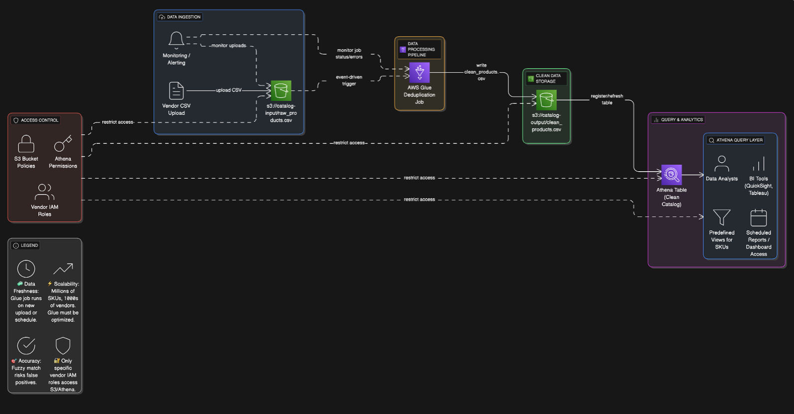

# SKU Deduplicator – Clean Product Catalog Pipeline

This project implements a real-time SKU deduplication pipeline using AWS services. Vendors upload raw product catalogs to S3, which triggers a Glue job to normalize and deduplicate records. The cleaned data is stored in S3 and queried via Athena.

## Business Problem
Vendors submit inconsistent or duplicate SKU entries. This pipeline standardizes and deduplicates catalogs to ensure data quality and improve downstream analytics.

## Architecture

- Vendor uploads CSV to S3 (`input/`)
- S3 triggers Glue job
- Glue normalizes and deduplicates SKU entries
- Clean data is saved to S3 (`output/`)
- Athena queries clean data for dashboards and reports

## Technologies Used

- Amazon S3
- AWS Glue
- AWS Athena
- CloudWatch (optional for monitoring)
- IAM (for access control)

## Sample Input

| product_id | sku    | product_name         |
|------------|--------|----------------------|
| 1          | SKU123 | Apple iPhone 14 Pro  |
| 2          | sku123 | apple iphone14 pro   |

## Sample Output

| product_id | sku    | product_name         |
|------------|--------|----------------------|
| 1          | SKU123 | Apple iPhone 14 Pro  |

## Notes

- Deduplication is based on normalized SKU + product name
- Normalization includes lowercase transformation and punctuation removal

