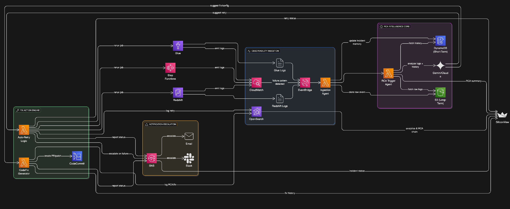

# SiliconPrimeX: Autonomous Glue Job Failure Diagnosis & Auto-Patching System



---

## Project Overview

**SiliconPrimeX** is an autonomous, AI-driven RCA (Root Cause Analysis) and patching system designed for AWS Glue job failures.

Whenever a Glue job fails, this system kicks into action:
- It retrieves the failure logs stored in S3.
- Generates a detailed RCA using Google Gemini.
- Stores the RCA in DynamoDB.
- Extracts patch suggestions (like `WorkerType`, `NumberOfWorkers`) from the RCA.
- Automatically applies those patches to the failed Glue job.
- Notifies the team via email using Amazon SNS.

The goal: **No more 2 AM wakeups to debug Glue failures**.

---

## Key Features

- **AI-Powered RCA** with Gemini
- **Auto-Patching** Glue jobs based on suggestions
- **DynamoDB** as RCA store
- **SNS Alerts** on success and failure
- **Modular Lambda Functions**

---

## AWS Services Used

- **AWS Lambda** – Logic for RCA + auto-patching
- **Amazon S3** – Stores Glue failure logs
- **Amazon DynamoDB** – Stores Gemini-generated RCA summaries
- **Amazon SNS** – Alerts for both success and failure
- **AWS Glue** – The ETL jobs being monitored
- **Google Gemini API** – For RCA generation

---
## ⚙️ How It Works – End-to-End

1. -  A Glue job fails.
2. -  Log file is dumped into S3.
3. - `lambda_rca_generator.py` is triggered manually or automatically.
4. -  RCA is generated using Gemini and stored in DynamoDB.
5. - `lambda_glue_auto_patcher.py` is triggered with `job_id`.
6. -  It fetches RCA from DynamoDB, extracts patch config, and updates the Glue job.
7. -  SNS notification is sent.

---

##  Example RCA Extracted from Log

```
The AWS Glue job failed due to an AnalysisException: column 'age' not found.
Suggested fix: change 'age' to an existing column like 'id'.
Patch: Use G.1X with 3 workers
```

---

## Real-World Impact

- Reduce Mean Time to Resolution (MTTR) from hours to minutes.
- Empower your DataOps/DevOps team with AI-based automation.
- Make Glue job failures self-healing.

---

## Author

**Ashish Kesari**  
[Data Engineer | AWS Certified | AI Automation Enthusiast]  
Built with ❤️ as part of #AWS100Projects
---

## Future Enhancements

- Slack/Teams integration
- Auto rollback on patch failure
- Scheduled Gemini re-analysis for high-impact jobs

---

> Let your pipelines fix themselves.
