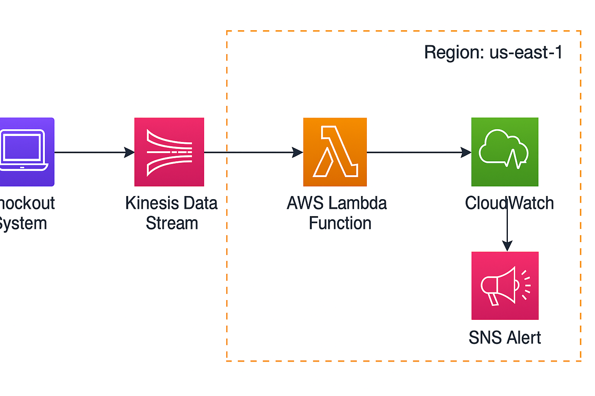

# Real-Time Payment Failure Monitoring – Prime Day 2025



## Overview

This project implements a real-time payment failure monitoring system using AWS cloud services. It simulates payment traffic during Amazon Prime Day and monitors for spikes in failure rates. If failures exceed 2% within a rolling 60-second window, alerts are triggered immediately. This prevents revenue loss and enables fast DevOps response during high-traffic e-commerce events.

## Key Features

- Simulates live checkout events via a Python script
- Streams events to Amazon Kinesis
- Processes events in real time using AWS Lambda
- Calculates a per-minute failure rate
- Publishes custom metrics to CloudWatch
- Sends alerts via Amazon SNS when failure rate > 2%

## Architecture

```


```

## Technologies Used

- Amazon Kinesis
- AWS Lambda
- Amazon CloudWatch
- Amazon SNS
- Python (boto3)

## Project Structure

```
prime-day-monitoring/
├── producer/
│   └── producer.py
├── lambda/
│   └── lambda_function.py
├── README.md
└── architecture.png
```

## Sample Event Format

```json
{
  "transaction_id": "txn_82473",
  "user_id": "u12345",
  "payment_status": "FAIL",
  "timestamp": "2025-07-09T19:03:10Z",
  "device": "mobile",
  "region": "US-WEST"
}
```

## Setup Instructions

### Prerequisites

- AWS CLI installed and configured (`aws configure`)
- Python 3.x installed with `boto3`
- AWS IAM permissions for Lambda, Kinesis, CloudWatch, SNS

### Steps

1. **Create a Kinesis Stream**
   ```bash
   aws kinesis create-stream --stream-name payment-events-stream --shard-count 1
   ```

2. **Run the Event Producer**
   ```bash
   python producer.py
   ```

3. **Deploy the Lambda Function**
   - Use the code in `lambda_function.py`
   - Runtime: Python 3.9
   - Trigger: Kinesis stream
   - Add IAM role with permissions for CloudWatch, Kinesis, and SNS

4. **Create SNS Topic and Subscribe**
   ```bash
   aws sns create-topic --name PrimeDayPaymentAlerts
   aws sns subscribe --topic-arn <TOPIC_ARN> --protocol email --notification-endpoint you@example.com
   ```

5. **Create CloudWatch Alarm (Optional)**
   ```bash
   aws cloudwatch put-metric-alarm      --alarm-name HighPaymentFailureRate      --metric-name PaymentFailureRate      --namespace PrimeDay2025      --threshold 2      --comparison-operator GreaterThanThreshold      --period 60      --evaluation-periods 1      --statistic Average      --alarm-actions <SNS_TOPIC_ARN>
   ```

## Cleanup

```bash
aws kinesis delete-stream --stream-name payment-events-stream --enforce-consumer-deletion
aws sns delete-topic --topic-arn <SNS_TOPIC_ARN>
aws lambda delete-function --function-name PaymentFailureMonitor
aws cloudwatch delete-alarms --alarm-names HighPaymentFailureRate
```

## Author

Ashish Kesari  
AWS Certified | Data Engineer  
[LinkedIn](https://www.linkedin.com/in/ashishk18/)
