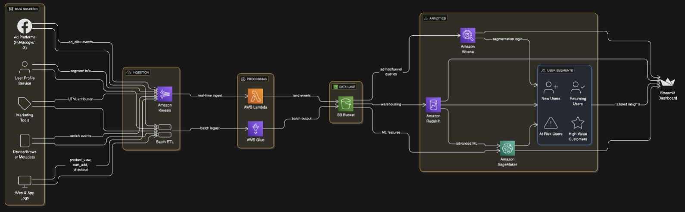

# 🛍️ Customer Journey Funnel Analytics on AWS (Simulated Full Stack)

This project simulates a production-scale **Customer Journey Funnel Analytics** pipeline using AWS architecture principles, with end-to-end implementation using Python, Athena-style SQL, and Streamlit — all aligned to a real-world AWS deployment pattern.

---

## 📊 Project Overview

Track and analyze user journeys from `Ad Click ➡️ Product View ➡️ Cart Add ➡️ Checkout`, enriched with:
- Source attribution (`facebook`, `google`, etc.)
- UTM parameters (`cpc`, `email`, etc.)
- User segments (`New User`, `Returning`, `High Value`, `At Risk`)
- Campaign metadata (`prime-deal`, `retarget`, etc.)

---

## ✅ Architecture Layers & Coverage
*Customer Journey Funnel – AWS Architecture Overview*

## 🧱 Simulated AWS Components

These components replicate AWS services using local Python scripts:

### 🔹 `lambda_etl_processor.py`
Simulates an **AWS Lambda** function that:
- Processes each event in real-time
- Adds enrichment metadata
- Mocks delivery to S3

### 🔹 `glue_batch_transform.py`
Simulates an **AWS Glue Job** that:
- Reads raw funnel data
- Cleans, enriches, and segments it
- Outputs cleaned data

## 🚀 To Run Locally
pip install streamlit pandas matplotlib plotly
streamlit run final_streamlit_dashboard.py
---

## 📈 Dashboard Highlights

- 📊 Conversion funnel (static + interactive)
- 🎛️ Filters: source, device, user segment, campaign, UTM
- 📋 Segment & campaign-level insights
- 📁 Clean visual + tabular reporting

## 🧡 Built with care as part of #AWS100Projects
