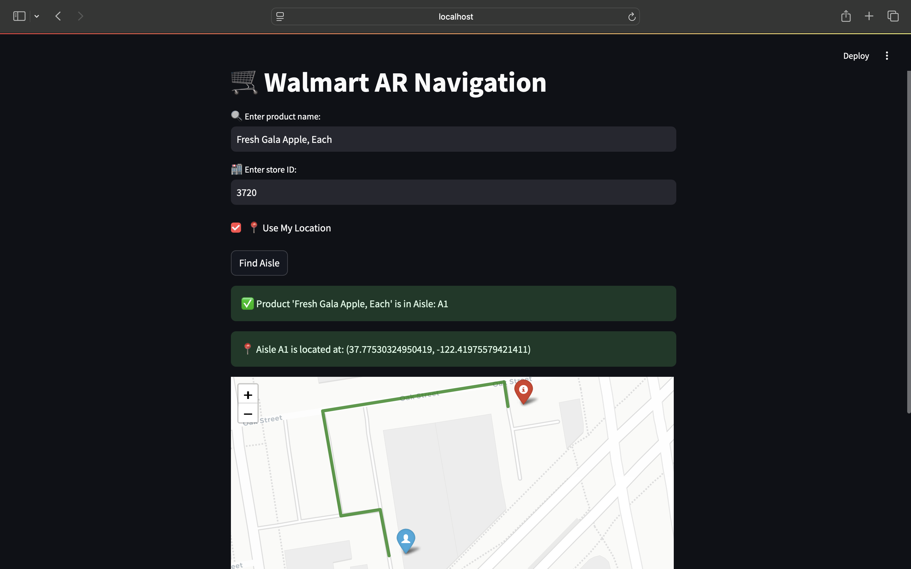

# 🛒 Walmart AR Navigation Web App  

  

## Overview  
The **Walmart AR Navigation Web App** is an AI-powered indoor navigation system that helps customers locate products inside Walmart stores **instantly**.  

### 🔹 **Features**  
✔️ Find **exact aisle location** of any product.  
✔️ Get **real-time navigation** from your location to the product's aisle.  
✔️ AI-powered **store mapping** using **Google Gemini API**.  
✔️ **Shortest route generation** using **Mapbox Directions API**.  

---

## Tech Stack  
- **FastAPI** – Backend for fetching product aisle locations.  
- **Google Gemini API** – AI-powered aisle detection.  
- **Streamlit** – Interactive frontend for seamless user experience.  
- **Mapbox API** – Real-time navigation inside Walmart stores.  
- **Folium** – Map visualization for route navigation.  

---
## 🔧 Installation & Setup  

### **1️⃣ Clone the Repository**  
```bash
git clone https://github.com/ashishkesari18/walmart-ar-navigation.git
cd walmart-ar-navigation
